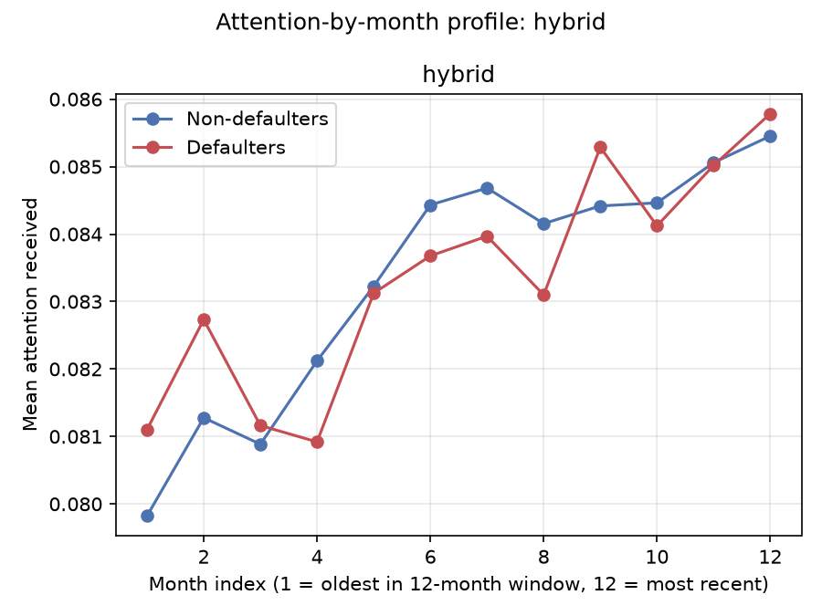
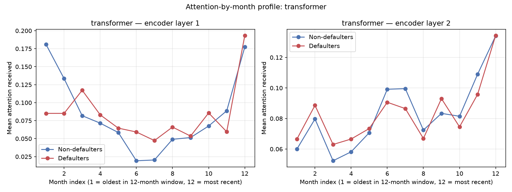
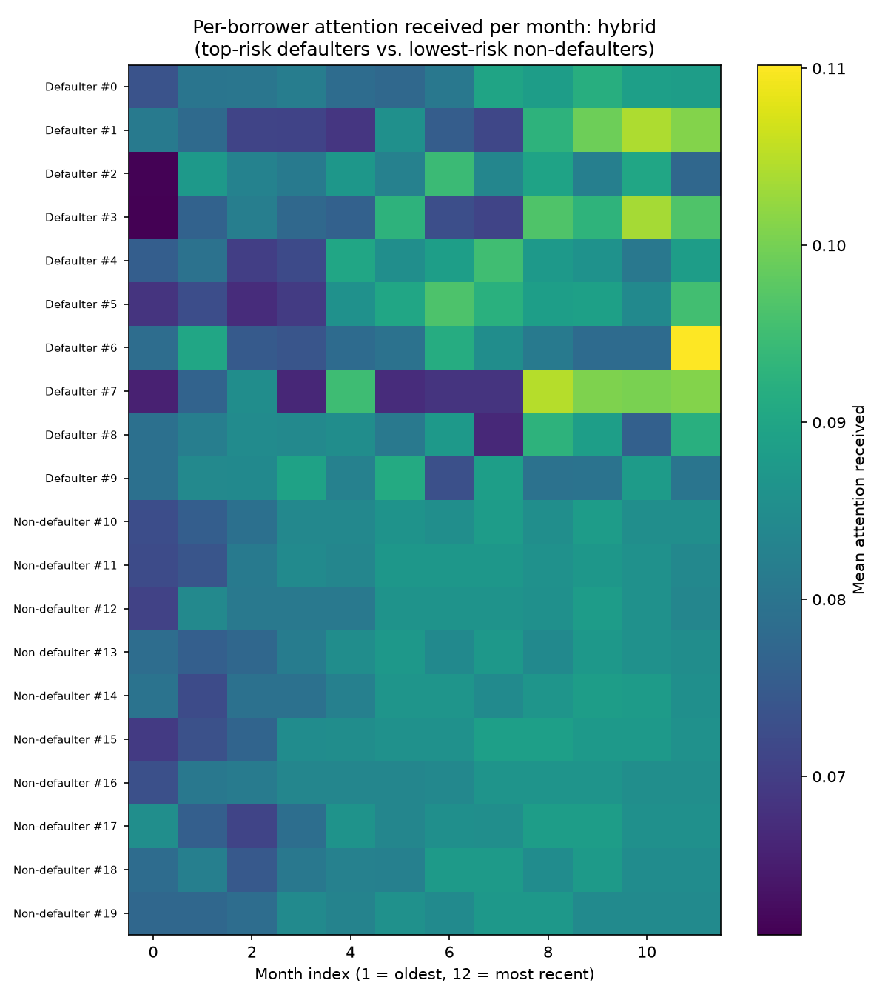
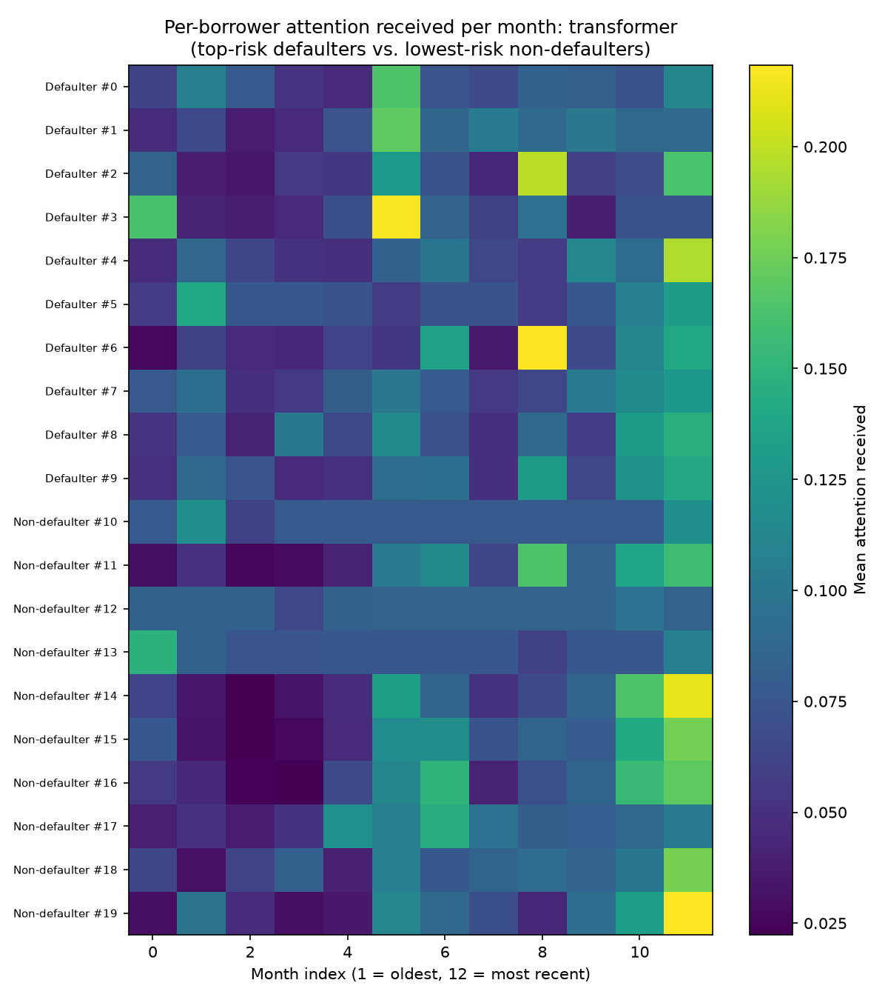
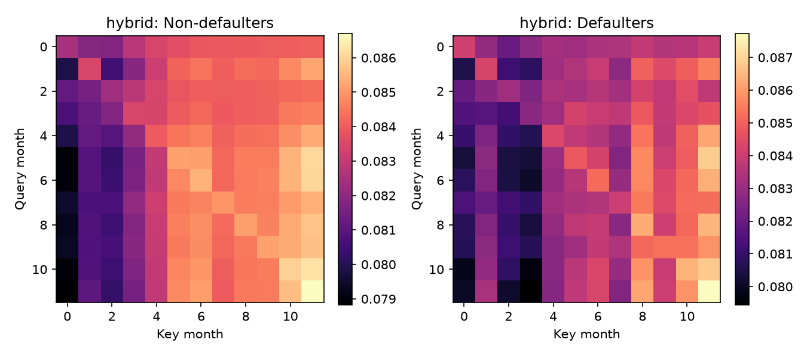
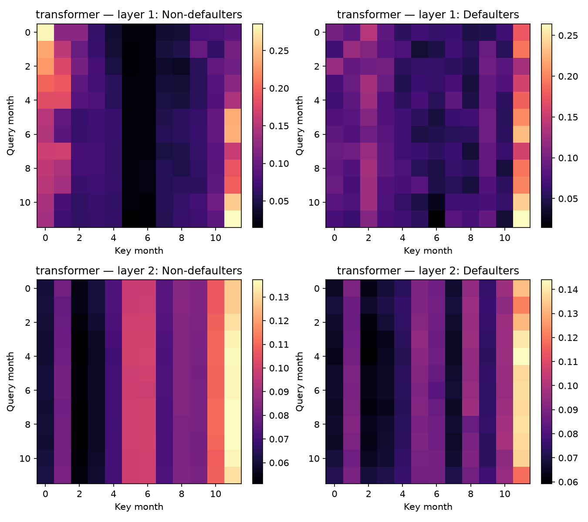
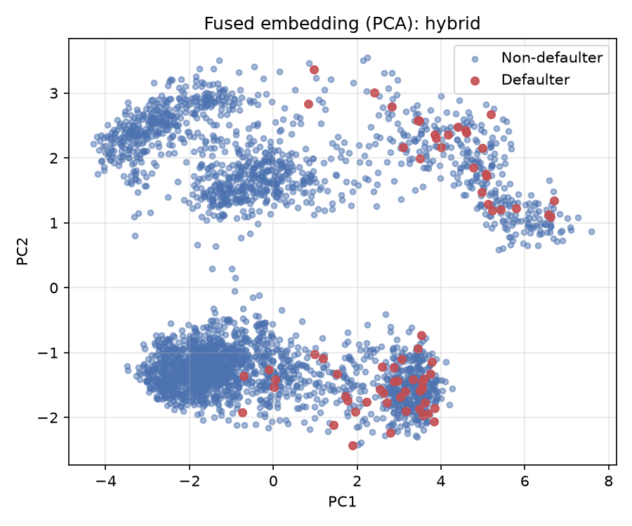
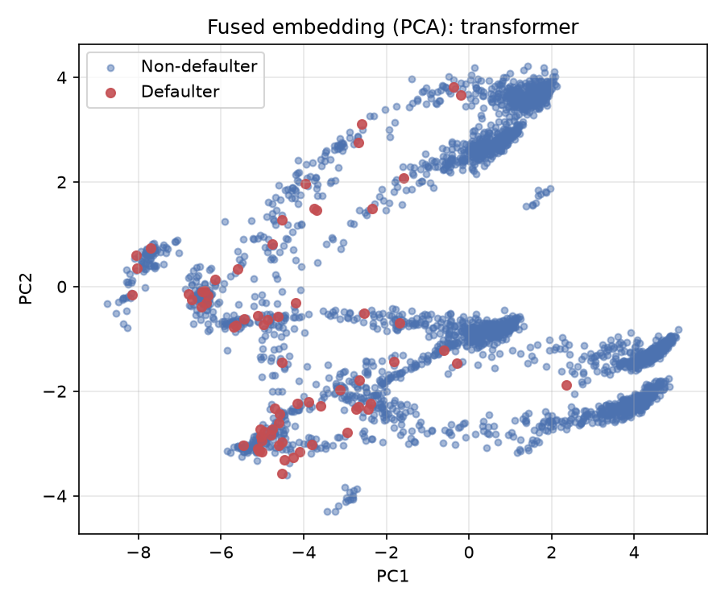

# Attention Study

## Why this exists

Keras's `MultiHeadAttention` computes attention weights internally but only returns them if
called with `return_attention_scores=True`. Neither `lstm_encoder.py` (the hybrid model's
temporal encoder) nor `transformer_model.py` requests them, so a trained model's attention
weights aren't otherwise retrievable — the computation happens and is immediately discarded.

`attention_visualization.py` defines "attention-exposing twin" architectures that mirror the
production models layer-for-layer but add the attention weights and the pre-output fused
embedding as extra, loss-free outputs. `run_interpretability_study.py` trains these twins
directly (loss on the risk-score head only) with the same stratified 5-fold CV, class
weighting, and early stopping as the production scripts, then pools attention weights and
embeddings out-of-fold.

These are **independently retrained instances** of the same architectures, not the exact
benchmark checkpoints (see [Note on model provenance](#note-on-model-provenance) below). Their
own pooled OOF metrics:

| Model | Precision | Recall | F1 | AP | ROC-AUC |
|---|---|---|---|---|---|
| Hybrid (interpretability twin) | 0.145 | 0.157 | 0.151 | 0.106 | 0.833 |
| Transformer (interpretability twin) | 0.104 | 0.600 | 0.178 | 0.095 | 0.871 |

## 1. Attention-by-month profile

Mean attention received by each of the 12 monthly time steps (1 = oldest in the window,
12 = most recent), averaged separately over defaulters and non-defaulters.

- **Hybrid**: a simple, near-monotonic *recency ramp* — attention received rises steadily from
  month 1 to month 12. Nearly identical shape for both classes.
- **Transformer, layer 1**: a **U-shape** — heavy weight on both the oldest and the most recent
  month, a dip in the middle. Layer 2 flattens this back into more of a recency pattern.
  Defaulters concentrate almost all of layer 1's attention on the single most recent month,
  while non-defaulters split it between oldest and newest — a genuine, class-linked behavioral
  difference the aggregate hybrid plot doesn't show.

## 2. Per-borrower attention heatmap

Top-risk defaulters vs. lowest-risk non-defaulters, attention received per month, one row per
borrower.

- **Hybrid**: top-risk defaulters show *spiky, concentrated* attention (bright, punctate
  columns on specific recent months); lowest-risk non-defaulters show a *smooth, uniform*
  pattern across all 12 months. This class contrast is visually clean.
- **Transformer**: both classes show similarly punctate, individualized patterns — the class
  contrast the hybrid model shows this cleanly is not present here.

## 3. Full month-by-month attention matrix

Query month (row) × key month (column), averaged over all borrowers in each class.

**This is the most important structural finding of the attention study.** In both
architectures, every row produces nearly the same column pattern — i.e. attention depends
almost entirely on *which month is being looked at* (the key), not on *which month is doing
the looking* (the query). The mechanism has collapsed into a fixed, learned "month-importance"
filter rather than genuine content-dependent, query-conditioned attention. This holds for both
models, so it isn't a hybrid-specific or transformer-specific quirk — it appears to be what
this attention setup converges to on this dataset/task regardless of architecture.

Within that pattern, the transformer's layer 1 defaulters concentrate on the single most recent
key-month (a bright vertical stripe at month 12 with almost nothing on month 1), while
non-defaulters split weight between the oldest and newest key-months — consistent with the
attention-by-month profile above.

## 4. Fused embedding, PCA projection

2D PCA of the pre-output fused embedding (concatenated temporal + static embeddings, before
the final Dense/output layers), colored by true label.

Both models show **partial, not clean, separation**: defaulters concentrate in certain
regions/arms of the projection but heavily overlap with non-defaulters elsewhere — consistent
with the ~0.83–0.87 AUC range, not evidence of a cleanly separated latent space. The
transformer's embedding shows several distinct branch-like arms (plausibly related to the
positional-embedding + projection structure); defaulters cluster densely in one specific arm.

## Note on model provenance

Checkpoints saved by earlier project sessions (`kfold_hybrid/`, `kfold_transformer/`, etc.)
are **not loadable** under the currently installed TensorFlow/Keras (2.21/3.14) — a
deserialization error occurs on the saved `GRU`/initializer configs. `requirements.txt` pins
`tensorflow>=2.16.0` with no upper bound, so a later `pip install` silently upgraded past
whatever version originally saved those files. The models used for this entire interpretability
study (attention + Integrated Gradients) were retrained fresh under the current environment
for this reason. Their pooled OOF metrics are close to, but not bit-identical to, the canonical
benchmark comparison numbers reported elsewhere in this project — expected run-to-run variance
from independent training, not a regression. **Recommend pinning an upper TensorFlow bound**
(e.g. `tensorflow>=2.16.0,<2.20`) to prevent this from recurring.
