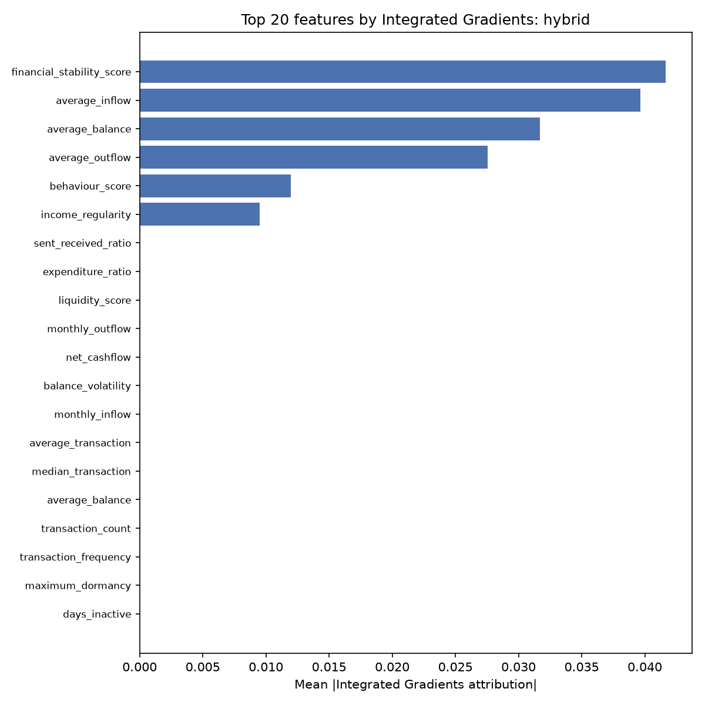
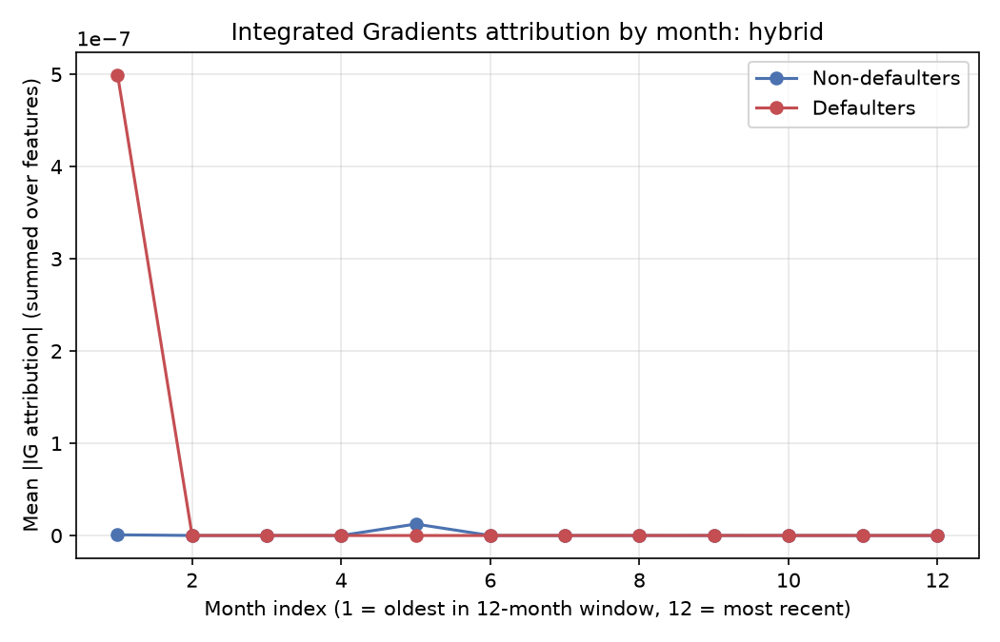
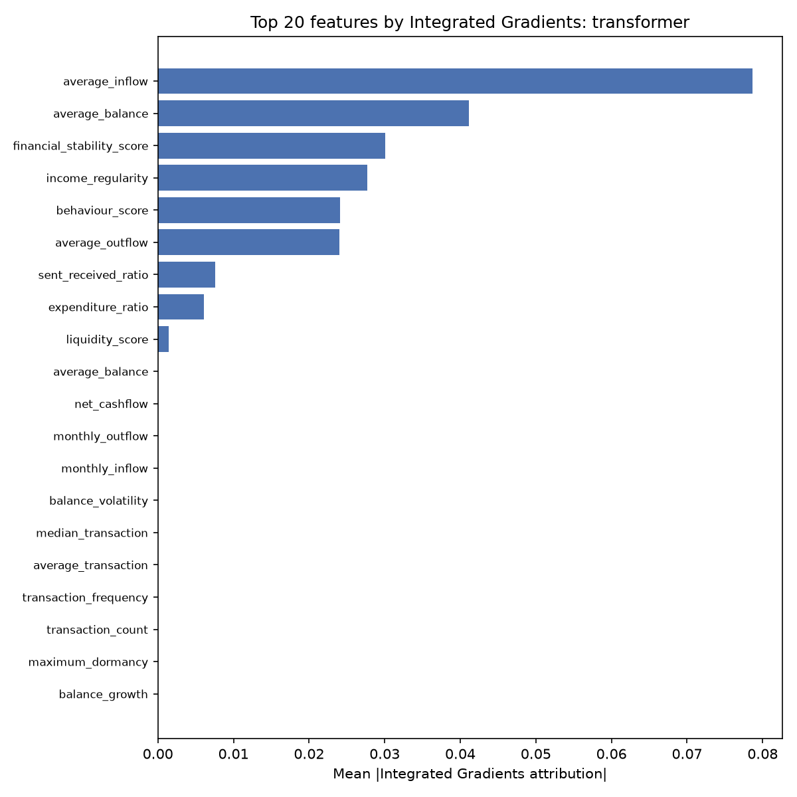
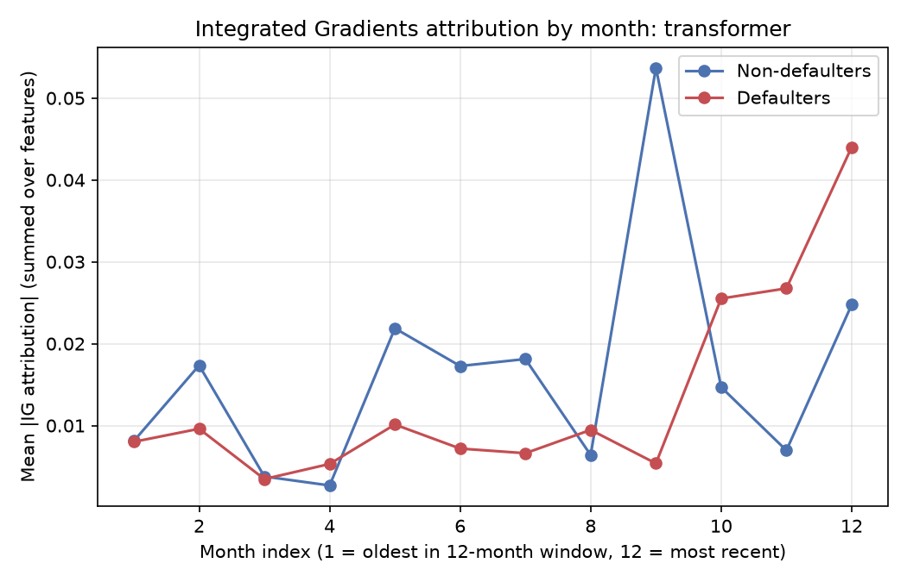

# Integrated Gradients Study

## Why Integrated Gradients, not Captum

Captum is PyTorch-only and cannot attach to a `tf.keras` model. Two ways to use it were
considered: (a) port a model to PyTorch and use real Captum, at the cost of adding a second ML
framework to the project and explaining a separately-trained model, or (b) implement Integrated
Gradients (Sundararajan et al., 2017) — Captum's flagship method — directly against the
existing Keras models. Option (b) was chosen: the algorithm (average the gradient of the output
w.r.t. the input along a straight-line path from a baseline to the real input, scale by
`input - baseline`) is short enough to reimplement natively (`integrated_gradients.py`), with no
new dependency and no parallel model.

Baseline: each training fold's own **per-feature mean** ("average borrower"), not zero — see
[Baseline choice](#baseline-choice-and-a-nan-bug-along-the-way) below for why zero doesn't work
for this architecture.

Explained: all 70 positive borrowers (the full minority class) plus a random sample of 200
negatives (270 total), each explained by the fold model that held it out (OOF), matching the
subsampling approach already used for the SHAP explainer in `explainability.py`.

## Headline finding: the two models depend on opposite branches

Cross-validated with an **independent, non-gradient method** (ablation: replace one branch's
input with the training-mean, measure how much predictions move) precisely because the
transformer's IG numbers turned out not to be trustworthy (see below) — the ablation result
does not depend on gradients or path integrals at all.

| | Hybrid (GRU+Attention) | Transformer-Encoder Hybrid |
|---|---|---|
| Ablate temporal branch → correlation with real predictions | **0.985** (barely changes) | 0.664 (changes a lot) |
| Ablate static branch → correlation with real predictions | 0.737 (changes a lot) | **0.955** (barely changes) |
| IG: total attribution mass, temporal branch | ≈1.17e-8 (≈0) | not reliable enough to report (see below) |
| IG: total attribution mass, static branch | 0.162 | not reliable enough to report (see below) |

**For the hybrid model, IG assigns essentially zero attribution to any of the 35 monthly
transaction features** — the largest single temporal feature's mean |attribution| is ~7.7e-10,
against a static-branch feature (`financial_stability_score`) of 0.042. All predictive signal
flows through the static (FNN) branch. The GRU-Attention branch computes a real attention
pattern (see the attention study), but it barely reaches the final decision: the fusion/output
layers have effectively learned to rely on the static branch instead.

**The transformer shows the reverse** in the ablation test — ablating the temporal branch drops
prediction correlation to 0.66 (a real effect), ablating static barely moves it (0.95). This
model genuinely depends on the transaction sequence, unlike the hybrid model.

See `data/ig_feature_importance_hybrid.csv` for the full per-feature ranking. Top static
features by mean |IG attribution|: `financial_stability_score` (0.042), `average_inflow`
(0.040), `average_balance` (0.032), `average_outflow` (0.028), `behaviour_score` (0.012),
`income_regularity` (0.009). Every other feature (all 35 temporal features, and 5 of the 12
static features) is indistinguishable from zero.

The by-month plot is flat at ~1e-7 for every month, both classes — consistent with the
near-zero temporal attribution above; the one visible spike is noise from a single borrower in
a 12-example reliable sample, not a real pattern.

## Why the transformer's IG numbers are not trustworthy

Predictions are sigmoid-bounded to [0, 1], so a well-behaved convergence delta (the standard IG
sanity check: `sum(attributions) - (F(x) - F(baseline))`, which should be near zero) should be a
small fraction of that range.

| | Hybrid | Transformer |
|---|---|---|
| Borrowers explained | 270 | 270 |
| Median \|convergence delta\| | 0.054 | 3,453.57 |
| Discarded as unreliable (\|delta\| ≥ 1.0) | 10 | **242** |
| Reliable sample remaining | 260 | 28 |

Diagnosing one failing borrower directly: the risk score stays smooth (~0.25) all the way to
α = 0.9999 along the baseline→input path, then jumps to ~0.10 **exactly** at α = 1.0 (the real
input) — a near step-function right at the boundary point, not a resolvable curve. Increasing
`m_steps` from 50 → 200 → 1000 shrank the delta (−1501 → −375 → −75) but nowhere near enough;
this is not a resolution problem. The straight-line interpolation path passes through synthetic,
off-distribution points the model was never trained on, and the transformer's per-block
LayerNormalization appears far more sensitive to this than the hybrid's GRU-based encoder — a
known, documented limitation of vanilla Integrated Gradients, evidently more severe for
LayerNorm-heavy self-attention stacks than for recurrent ones on this task.

Practical consequence: the transformer's `ig_feature_importance_transformer.png` and
`ig_by_month_transformer.png` (included for completeness) are based on only 28 surviving
borrowers (12 positive, 16 negative) and should be read as suggestive at best, not as a
reliable ranking — the ablation result is the trustworthy evidence for "temporal matters more
here," not the IG magnitude.

## Baseline choice, and a NaN bug along the way

An all-zero baseline was tried first and produced `NaN` for every borrower. Root cause:
`Masking(mask_value=0.0)` treats an all-zero time step as padding, and `GlobalAveragePooling1D`
divides by the count of valid (non-masked) time steps — with a fully-zero baseline sequence,
that count is zero, so the pooling layer computes 0/0. Verified directly: feeding an all-zero
`(temporal, static)` pair straight into the trained hybrid model returns `NaN` for the risk
score, independent of Integrated Gradients entirely. Switched to the training fold's per-feature
mean, which is not naturally zero for any of these features and resolved it — also a more
defensible choice generally, since static features (age, income, ...) aren't zero-anchored the
way a padded time step is.

## A second bug found and fixed along the way

Loading the transformer's saved checkpoint in a fresh process failed with
`Could not locate class 'module'` — `transformer_model.py`'s masking `Lambda` layers pass the
raw `tf` module itself as a Lambda `arguments` entry (a comment in that file says this was
originally added to make `tf` available when unpickling within the *same* process). That
pattern doesn't survive a genuine Keras 3 save/load round-trip in a new process. Fixed for the
interpretability twin by replacing the three `Lambda` layers with proper registered `Layer`
subclasses (`PaddingMaskLayer`, `ExpandMaskLayer`, `MaskedGlobalAveragePooling1D` in
`attention_visualization.py`), verified with an explicit save/load roundtrip (zero prediction
difference). Worth porting back to `transformer_model.py` itself if that production model ever
needs to be reloaded in a new process.
